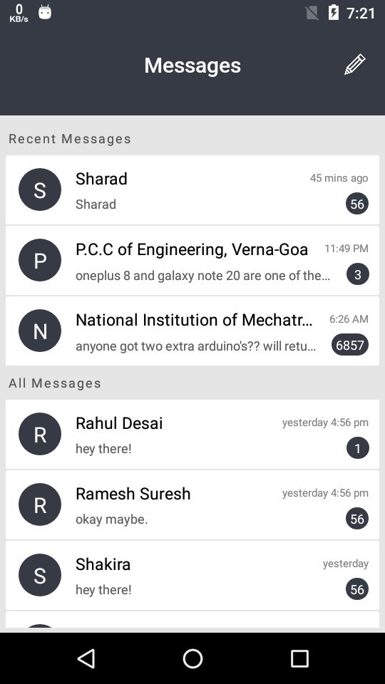

# Message
A chat-app with React Native and Socket.io

### Dependencies
> ### Build

##### Client: ***`React Native`*** ***`Redux`*** ***`Firebase`*** 

##### Server: ***`Express`*** ***`Socket.io`*** 

> ### Dev

##### Client: ***`Typescript`*** 

##### Server: ***`Typescript`*** 
